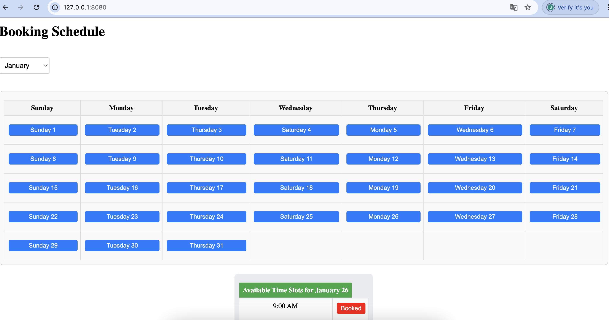

# **Booking Appointment App using TypeScript**

This app is designed for booking appointments with service providers such as carpenters, plumbers, or other tradespeople. Built with TypeScript, it allows customers to view available appointment slots, book a time, and instantly see when a service provider is available. This app’s sleek design ensures scalability and has the potential for advanced backend integrations.

---

## **Features**

1. **Booking System**: Users can view available time slots for a carpenter/plumber and seamlessly book appointments.
2. **Availability Display**: The schedule is shown from Monday to Friday, with pre-booked times marked as unavailable.
3. **Interactive UI**: A modern, intuitive user interface that allows customers to select available time slots with ease.
4. **Real-time Booking**: Changes to the booking status are immediately reflected in the UI, ensuring that availability updates are up-to-the-minute.
5. **Backend Integration (Future plans)**: In the future, the app will integrate with cloud-based backend services (like Firebase or AWS) to store live data, manage bookings, and track user interactions in real-time.

---

## **What’s Implemented So Far**

### **Frontend:**

1. **Booking System**: The app provides users with a weekly schedule to view and book available time slots (Monday to Friday) for service providers.
2. **Time Slot Availability**: Pre-booked slots are visually marked as unavailable to avoid double bookings.
3. **Interactive Booking**: Users can click on available time slots to reserve them, and booked slots immediately update to show their status.
4. **Visual Feedback**: A color-coded system shows booked slots in red, while available ones are highlighted in blue, offering users an intuitive experience.
5. **Calendar Navigation**: The app includes a calendar view where users can easily navigate between months and select the day for booking.

### **Files:**

- `index.html`: The main structure and interface for booking appointments.
- `src/app.ts`: Handles the booking logic, displaying available slots, and managing state for booked slots.
- `src/styles.css`: Provides essential styling for the calendar and booking interface.
- `src/index.ts`: Initializes and connects the app logic, including the calendar and booking functions.

---

## **Progress from Last Year**

1. **Interactive Calendar**: Introduced a calendar interface where each day has clickable buttons that display available timeslots.
2. **Real-time Booking**: Added functionality for users to click on available slots, book them, and see immediate updates in the UI.
3. **State Management**: Implemented a robust state management system using a `Set` to track booked slots for each day.
4. **Visual Updates**: Introduced clear visual indicators for booked slots, with disabled buttons and red highlights.

---

## **Future Improvements**

1. **Backend Integration**: The app will integrate with a cloud-based backend (e.g., Firebase or AWS) to manage live data and provide real-time updates on availability.
2. **User Registration and Login**: Users will soon be able to create accounts, log in, and manage their appointments directly from their personal dashboards.
3. **Notifications**: Implement a notification system for customers and service providers to receive real-time alerts about bookings, cancellations, and updates.
4. **Mobile Optimization**: The app will be optimized for mobile devices to ensure full functionality across smartphones and tablets, providing a seamless experience on any device.

---

## **How to Run the App Locally**

1. **Clone the repository**:
   ```bash
   git clone https://github.com/jaimehernan95/typescript-app.git

## How to Run the App Locally

1. **Clone the repository**:
   ```bash
   git clone https://github.com/jaimehernan95/typescript-app.git


## Final Result

This is the final result of the task. The image below shows the working calendar with time slot booking functionality.


